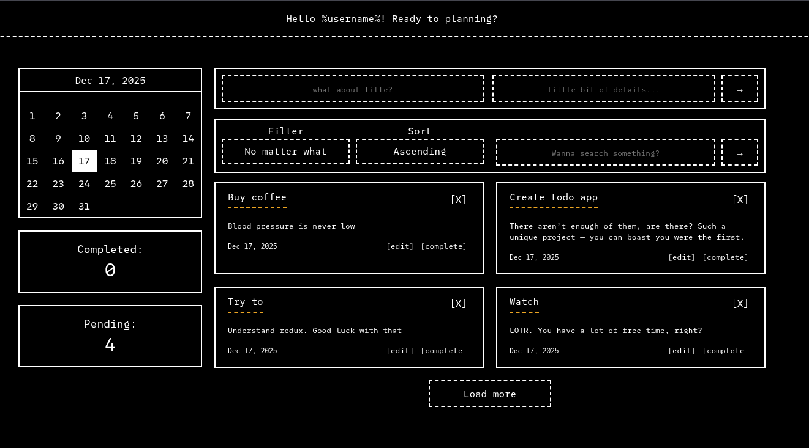

# todo app


<p align="center">
  
</p>

Simple todo app on React + TypeScript in CLI-like style.

# Installation

- Clone this repo.

```bash
git clone https://github.com/bvbxbv/todo-app.git
```

- Install dependencies.

```bash
pnpm install
```

- After all you can run dev server and use app.

```bash
pnpm run dev
```

# Features

- Add, edit, remove or complete as mark your todos.
- Filtering todos by:
    - title.
    - date. Not comfortable? You can use calendar. (it's on app page)
    - description.
- Stats, which showing number of your completed (or not completed) todos.
- Persistent storage using IndexedDB
  (todos are saved between page reloads and browser restarts)

# Credits

This is what helps me with this project.

- React - https://react.dev/learn
- Redux - https://redux.js.org/usage/
- TypeScript - https://www.typescriptlang.org/docs/
- Webpack - https://webpack.js.org/concepts/
- SASS/SCSS - https://sass-lang.com/documentation/
